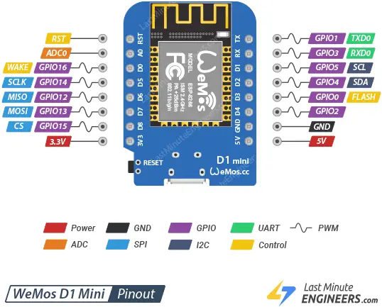
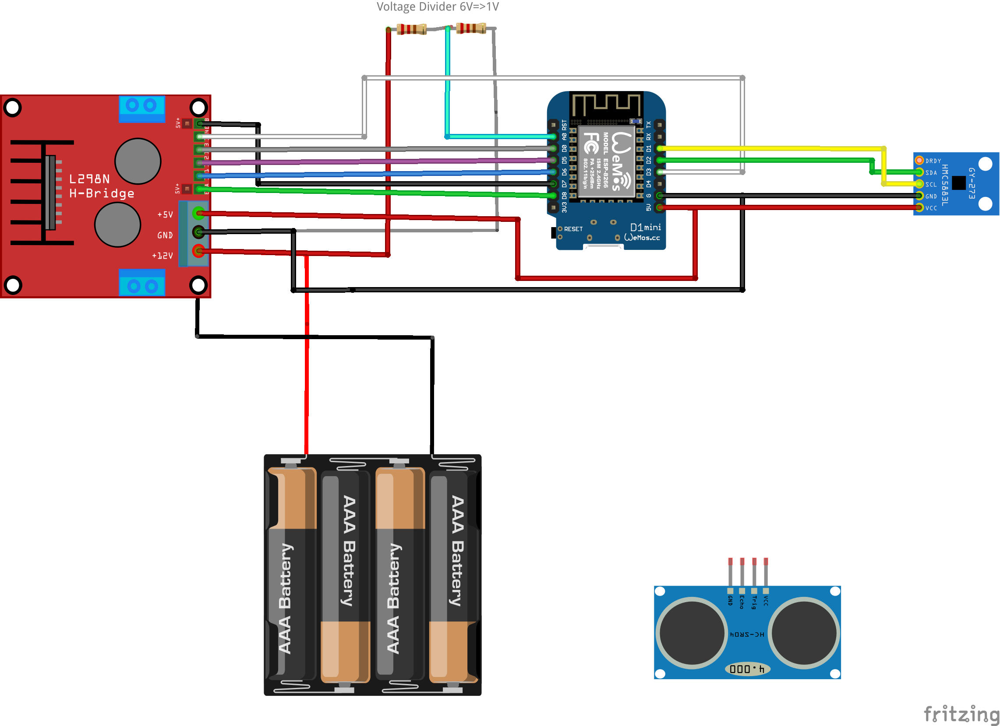

# Swarm Car

[Robocar by DAquad](https://www.thingiverse.com/thing:2786243)

[Technopolis awesome article how to run Mavlink on ESP32](https://www.technopolis.tv/blog/2023/07/12/How-to-use-MAVLink-on-ESP32/)
[Technopolis GIT](https://github.com/technopolistv/ESP32-MAVLink-Arduino-Example)

## ESP8266 Pinout

## Wiring

## PlatformIO Tutorial

https://www.youtube.com/watch?v=PYSy_PLjytQ

    .pio    => Installed libraries. Don't do anything here
    .vscode => Dont configure, settings
    include => Any header file you want to include, see READme
    lib     => For submodules you create. E.g. Generate a subfolder names OLED, put OLED.cpp and OLED.h here 
    src     => containes classic main.cpp. Need to include frame work <Arduino.h> though
    test    => test driving development
    platformio.ini => configuration file in a code format. e.g. monitor_speed = 115200 for serial monitor

https://forum.fritzing.org/t/h-bridge-with-l298n-motor-driver/7711
https://forum.fritzing.org/t/gy273-qmc5883l-triple-axis-magnetometer-breakout/6106
